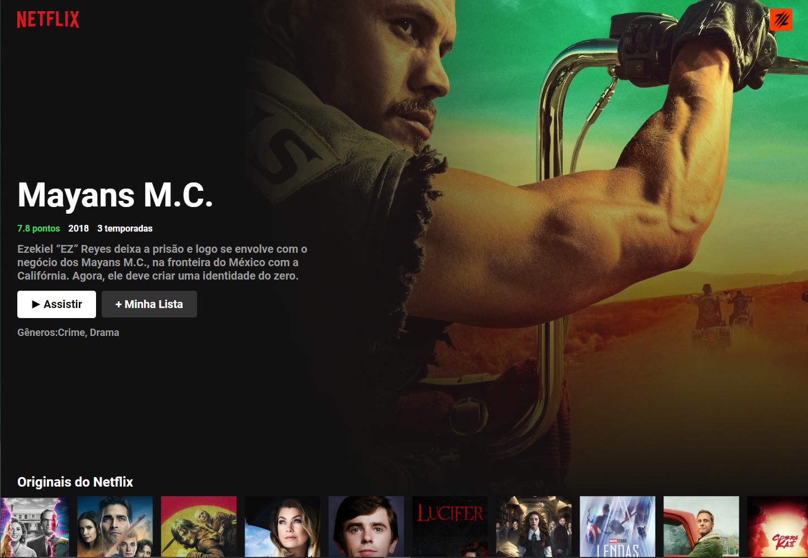
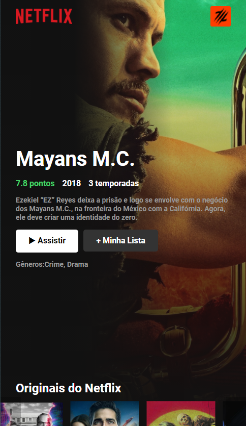
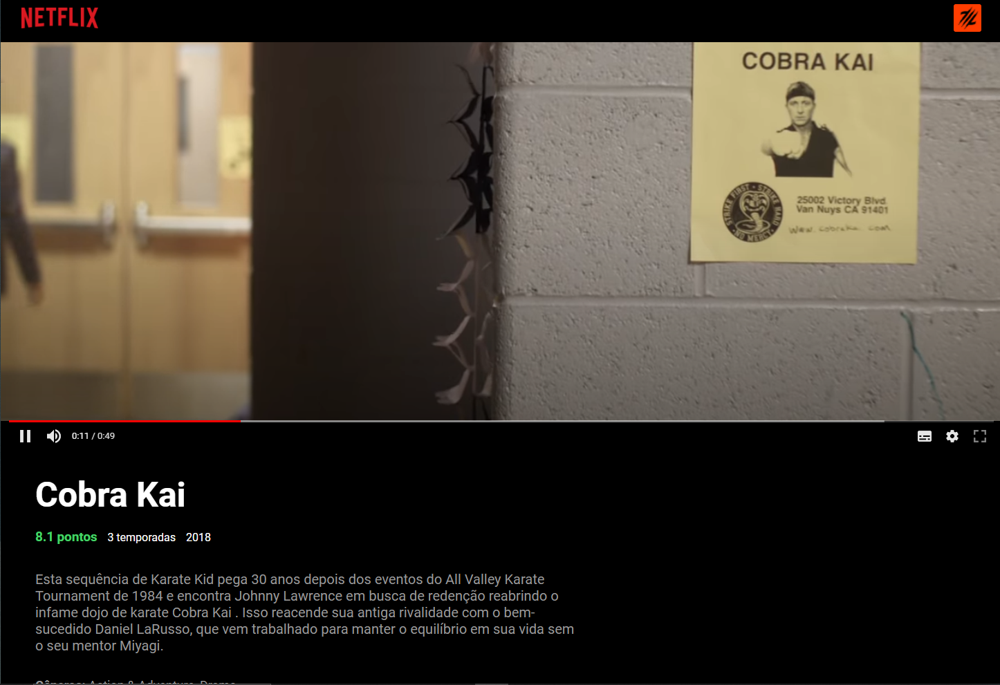

# Netflix Clone

## Sobre

Este clone da Netflix utiliza da api do TMDB para pegar as informações das séries.
Apenas a pagina incial foi feita com o auxílio das aulas do Boniek, a partir dela dei sequencia para a criação das rotas
e da página de visualização da série, que pega um video do YouTube para exibição e para essas requisições fiz a utilização do axios.

##Tecnologias:

* ReactJs
* CSS3
* JavaScript
* Axios

## Como utilizar:

 * Crie um clone do repositório
 * No terminal digite "yarn start"

## Galeria

